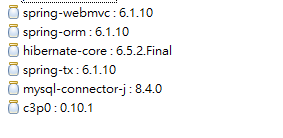

### JDK, JRE, JVM
#### JDK (Java Development Kit)
- software development env used for developing Java apps 
- it includes : JVM, JRE, Loader, Java compiler, Doc generator, Archive(jar), etc 

#### JRE (Java Runtime Env)
- software bundles (lib, class loader) that allows Java program to run (on JVM)

#### JVM (Java Virtual Machine)
- physical env to execute bytecode

### oop
#### Encapsulation
#### Inheritance 
**is/has concept eg (phone,pc,laptop IS computer) , (house has furniture, light)
#### Anonymous object (eg new A()) 
it only created on heap not stack because it didnt create variable eg int a; but simply a new A() object
Anonymous object : new A() // cant reuse
Referenced Object: A a = new A();

#### 2 parents problems (Ambiguity Problem):
when two parent have same function C->A , C->B (thats why Java not allow 2 parents extends)
C->B->A (thats work, because the missing function will find at B first, then A)

#### Overload (same method , diff variable)
#### Override (same method, diff code)

#### packages => folder (src)

#### Access Modifiers
Public, Private, Protected, Default
Same package have no error on not public variable
Assume src\A\A.java src\B.java src\Main.java, Main.java cant access (default) int marks on A.java but B.java
Default modifiers allow same package class to access
Protected allow same java file classes OR same package file to access (eg two classes inside same java file) OR subclass(child)

#### Polymorphism (many behaviour)
#### Compile Time Polymorphism (behaviour defined compile time)
eg Overloading add(int,int) add(float,float) add(int)
#### Runtime Polymorphism (behaviour defined runtime)
eg Overriding A(add())->B(add())
#### Dyanmic Method Dispatch (Polymorphism) (not sure which one to use before runtime)
B(child)->A(parent)  A obj = new B();  , B referenced as A, method on B will execute(show)
A obj = new A(); then obj = new B(); so the A method (show) execute then B method (show) execute
#### Downcast Upcast
Downcast refer A to B, refer float to int 
```double d = 4.5 int i = (int) d;```
Parent no idea child method exist, by upcast, Parent can use child method
Upcast , refer B to A , refer int to float (implicit)
```
A obj = (A) new B();  // its implicit (same as A obj = new B();)
obj.show2() // ERROR, still cant call because the reference A no idea B when not same method name
obj.show() // WORK, it works if B have show() too
// Downcast
B obj2 = (B) obj;
obj2.show2() // WORK, it downcast to B, because the reference is B now you can call B's method
```
#### Primitive vs Wrapper classes
Primitive (int, float, double)
Wrapper classes: Abstract (Object, Integer, String, Float, Double)
Auto-box Auto-unboxing concept 
eg int num = 7; Integer 2 = num; //Auto-box
Auto-boxing (store primitive value in an object)
eg int num3 = num2.intValue(); same as int num3 = num2; Auto-Unboxing (store object value inside primitive type)

Manual unboxing (store String into int)
```
String str = "12";
int num3 = Integer.parseInt(str);
```

#### Abstract
When no idea implementation during the class implementation, so left for it and let child to override it
Abstract method must override by child, and the classes is abstract if abstract method exist
Abstract Classes can't be created (only work if upcast) eg A obj = new B();
Abstract Class not necessarily have abstract method
Abstract method can be passed to future child, meaning some abstract can still be abstract method for child
Abstract Car(abstract drive & fly) -> Abstract Wagon(with drive) -> FlyCar(with fly)


#### Interface (Normal, Functional(SAM: Single Abstract Method), Marker(Blank Interface, update sth to compiler))
interface is for supporting multiple class in a method class 
eg Developer need computer, so if the method accept laptop, it cant accept desktop, all desktop and computer have same
method, thats why we need interface (Computer) and because computer is abstract we need interface than class

#### Functional Interface
In Java, everything have to write inside a class
However, it is tedious when function does not belong to any class
```
class HelloPrinter() {
　　public void hello() {
　　　　System.out.println("hello!");
　　}
}
// To call it
new HelloPrinter().hello();
```
So Functional Interface call it with interface or method reference(::)
```
@FunctionalInterface
interface Predicate<T> {
    public boolean test(T anyType) {
    
    }
} 
public static boolean startsWithS(String s) {
    return s.startsWith("S");
}
public class Main {
    public static void main(String[] args) {
        Predicate<String> sFilter = Main::startsWithS;  // method reference
        Predicate<String> sFilter = (s) -> {
            return s.startsWith("S"); 
        }
    }
}
```

####Marker Interface (For Serialization)
Serialization : store object A,B,C into harddrive , for recreate the object later (Deserialization)

####Error (Runtime, Compile, Logical)

####Exception(Runtime Error)

####--able (interface)
eg throwable, runnable, etc

#### Throwable (Checked:require try/catch block)
Child: Exception(Try/catch), Error(Cant try/catch)
Exception -> RuntimeException(Unchecked) , SQLException(Checked:Force), IOException(Checked:Force) -> ....
RuntimeException -> NullPointerException, ArithmeticException, etc

#### Throw vs Throws
Call catch block even not triggered by Exception 
```
// Outside Class
class CustomException extends Exception {
    public CustomException(String s) {
    
    }
}
// Inside Class
if(j==0) {
    throw new ArithmeticException("Here is custom Exception message")
    throw new CustomException("Hello");
}
...
catch(ArithmeticException e) {
    e output: java.lang.ArithmeticException: Here is custom Exception message
}
```
Throws (Throws the exception to who calling me)
C call the method of d,e and error that happen during d and e execution will go back to c and catch by c
```
c () {
    try {
        d();
        e();
    }
    catch() {
    
    }
}

d() throws Exception {
}
e() throws Exception {

}
```

####BufferedReader
``` 
// Old solution
InputStreamReader in = new InputStreamReader(System.in);
BufferedReader bf = new BufferedReader(in);
int num = Integer.parseInt(bf.readLine());
bf.close();

Scanner sc = new Scanner(System.in);
int num2 = sc.nextInt();
sc.close();
```
Resources is what we need to close (eg, connection, file, reader)

#### try, catch, finally
try catch  // valid
try catch finally // valid
try finally // valid
why try finally (with no catch?) : Because there is some case you dont want to catch in the current method but outside it
and you need some action eg close the scanner
Then you use try that take user input and finally close it
```
put the scanner inside try, it will close automatically
try(Scanner sc = new Scanner(System.in)){

}
```

#### Thread 
(run method must exist)
```
getPriority() // 1(least) to 10(highest) , 5(default)
A obj1 = new A();
obj1.start()
Thread.sleep(millis)
Thread.getPriority
// If want to make A subclass of Z, we can implements Runnable rather than extends Thread
Runnable obj1 = new A();
Thread t1 = new Thread(obj1);
t1.start();
// but now start is not working, make two Thread object (t1,t2) and t1.start() , t2.start()

// We can apply lambda / anonymous class on Runnable 
Runnable obj1 = new Runnable() {
    // Anonymous class : X x = new X() { } ;
    public void run() {....};
};

// Lambda 
Runnable obj1 = () -> {
    for(...){
        sout("xxx");
    };
};
```
####Race Condition
If two thread edit same variable, Race Condition happened
Mutation : value changeable (primitive, object)
Immutable (String)
####Thread Safe (only 1 thread work on 1 point)
t1.join(); // wait the t1 thread to finish execution (Sequence control)
t2.join()
However Race condition when t1,t2 execute same method
// Solution
// Synchronized Method
public synchronized void increment() {

}
// Synchronized code
synchronized () {

}
#### Thread State (New, Runnable, Running, Waiting, Dead)
New -> start() -> Runnable -> run() running on CPU -> Running  -> sleep(),wait() -> Waiting 
-> notify() -> Runnable
Running -> stop() -> Dead// Instability, Deprecated

#### Collection API (Collection, Collections)
Embedded classes (Data Structure eg Queue, LinkedList, Stack)
Collection : Interface
Collections : class
``` 
int nums[] = new int[5];

```
Collection -> List, Queue, Set 
List -> ArrayList, LinkedList
Queue -> Dequeue
Set -> HashSet(unsorted), LinkedHashSet, TreeSet(sorted)

Map not Collection API, but similar concept (HashMap, Map, LinkedHashMap, HashTable(syn) )

Collections class (Collections.sort())
Comparator (interface) vs Comparable (interface)
Comparator (Collections sort custom logic)
Comparable (Natural sort logic) 

eg Comparator: Collections.sort(a, com)
eg Comparable: Collections.sort(a)

#### Stream API (check stream\Stream, stream\Streams2)


#### jshell (similar as python in cmd)
/exit

#### Old compile vs Source Code Launcher(work with single file)
javac Demo.java
java Demo
Source Code Launcher: java Demo.java

#### LVTI (Local Variable Type Inference) : Type Inference (Only Allow local variables)
Type Inference eg (Lambda expression without express type)
Processing purpose : variable inside method
Instance : variable inside method (LVTI not allow)

```
var num = 8;
var list = new ArrayList<>();
```

#### Sealed Class vs Abstract Class, Final Class
Abstract Class(Base Class) define method and abstract method , then a Concrete class to override the abstract method
Sealed Class = Limited Class can inherit the class (Abstract + Final Concept)

#### Record Classes (hold data)
If Object is (1)Immutable and (2) only used for storage, we can create such Object by Record Classes
Generally, its difficult and tedious to create a class that store data (override equals, tostring and getter) [No setter]
Record Class is for Carrying Data, so its not changable in value once created object

#### JUnit5 (Unit Testing) vs Maven Test (Execute on surefire, not on IDE)
Maven Test must need to have maven-surefire-plugin plugin, all files in the test must start with
Test.java in order to work.

#### Abstract = Type perform Operation
Concept associated with Operation with Data => Abstract Data Type

#### JDBC (Java Database Connectivity)
DDL (Structure)
DML (Manipulation) // modification, so use executeUpdate (return int, return 4 mean 4 row affected)
DQL (Data Query Language) //fetching data, use executeQuery (return ResultSet)
TCL (Transaction Control Language)

#### DAO (Data Access Object) [Design Pattern]
Achieve Data fetching from a DAO class, which the DAO perform fetching or modification
#### Static Block & Instance Block
Class.forName() loading the class, so only trigger static block
abc a = new abc(); // it load static block and instance block together
```
class abc {
    static {
        
    }
    
    {
        System.out.println("Hello");
    }
}
```

#### Regular Expression (Regex)
Output simply match the number of match
```
. (just one instance of any character) eg Tom, Tam, Tim => T.m
+ (repeat 1 time above) eg Toom => To+m
* (repeat 0 time above) eg Tom, Tm => To*m => it true even o is not exist 
? (repeat 0 or 1 time)  eg Tom => T?m => True if T only have 1, or no T
\d (any 0~9) eg 123 => \d => output: 3, because 3 matching
\d+ eg 123,123,456 => output:2 , find longest match any no repeat (so 123 count only 1 time)
 
\w (any alphabet in 1 character) eg a~z, A~Z, 0-9 , eg \w+ will imply the longest character until space eg (cat is cute) => output (cat, is, cute)
{} (repeat any time) 
    for example, a => a , get all with a match , aaa => aa => it will exclute last a so output :(aa) 
    with {} , aaa => a{2} => ouput:(aa) , exactly same as above
    a{2,3} meaning match a with 2 or 3 time match  , eg aaaa,aa => a{2,3} => output aaa, aa
    a{2,} meaning a with 2 to unlimited match
    eg aaaa => a{2,} => output: aaaa
() priority calculate 
| OR eg ab,bc => ab => output: ab (1 output), with OR , ab,bc => ab|bc => ab,bc (2 output)
     eg ab, abc, bcc => (ab|bc)c => output: abc, bcc (2 output), because we first find ab or bc, then it match with c
[] match any character eg abcd => [aed] imply a or e or d=> a,d (2 match) 
    [a-c] mean a to c
[^] exclude , eg [^abc] any character exclude abc
\ literal imply the exactly meaning 
    eg $5.99 => $5.99 => cant match because the (.) and ($) imply instace of $ , THEREFORE , $5.99 => \$5\.99

^ start of the line
$ end of the line
Example:
Hello World Hello
Hello Hello
Hello World
Pattern: ^Hello , () imply output, only start of the line match
(Hello) World Hello
(Hello) Hello
(Hello) World
Pattern: Hello$ , end with Hello
Hello World (Hello)
Hello (Hello)
Hello World
Example 2 , H.*d$ , it starts with H and repeat any character, BUT END OF LINE
Hello World Hello
Hello Hello
(Hello World)
(Hello Worldd)
only last (Hello World) is matched, because the (d$) expression, (Hello World Hello) is not end with (d)

\b word boundary (start or end with boundary) 
Example (start boundary):
Jan
Jane
Janet
Jannne
123Jane
Pattern: \bJan
(Jan)
(Jan)e
(Jan)et
(Jan)nne
123Jane (not match because its not start with Jan in every word)
Example (start and end boundary):
Pattern: \bJan\b
(Jan) is the only output, because it arround with space (start and endboundary)


() Not only priority but also Capturing Group , Save the Match item and use it alter
Example:
The dog is big.
The dog is fat.
The cat is thin.
Wow, The cat is cute.
Pattern: The \w+ is \w+\.
(The dog is big.)
(The dog is fat.)
(The cat is thin.)
Wow, (The cat is cute.)

Pattern: (The \w+ is \w+\.) , the output is captured and can use later
Example:
In VS Code, Ctrl F and open Regex ($1, $2 will be the capture group result)
Search: (The \w+ is) (\w+\.) , we now have 2 capture group , $1 and $2 can be repeatedly use
Replace: $1 tiny.
Result:
The dog is tiny.
The dog is tiny.
The cat is tiny.
Wow, The cat is tiny. // Wow will not disappear

(?:) Not use Capture Group eg (?:big|fat|thin) , it will consider () as priority only but not capture group
```

#### Regex Pratice
##### EX1 (find number)
Call us at (555) 123-4567 or (123) 986-6543 , 
Answer : \(\d{3}\) \d{3}-\d{4}
##### EX2 (find email) (the email dont have special symbol except @ and .) 
[a-zA-z0-9.]+@[a-zA-z0-9]+(?:\.[a-zA-Z0-9]+){1,} (only . and @ allow) so first 3 row is searchable but not last one
Contact us at abc@example.com.hk or admin@domain.org..
James.ku@gmail.com
james.ku@abc.org
Jake-kk@gmail.com
abc@not123.com

(the email  have special symbol for - and .)  Step:
allow specifal symbol (but 1 @ only )
[\w.-]+  (it allow ONE character with any alphabet AND '-' , repeat ONE or above time)
(abc)@(not123.com)

Answer: [\w.-]+@[\w.]+\.[a-zA-Z]{2,63}  
why {2,63} because the top domain (com, org ,hk) is at most 63, and [a-zA-Z] prevent . symbol eg(admin@domain.org..)

##### EX3 (change date format from YYYY-MM-DD to MM-DD-YYYY)
2024-06-08
2024-12-25
2024-01-01
to
06/08/2024
12/25/2024
01/01/2024
answer : (\d{4})-(\d{2})-(\d{2})  , replace: $2/$3/$1

How java perform Regex 
case 1:(true,false) by find() , print it to get pattern, region and last match
case 2: matches() and group() for capture group
without capture group () in Pattern, it will only have toString result
```
java.util.regex.Matcher[pattern=[\\w]3Schools region=0,16 lastmatch=W3Schools]
```

```
// Case 1:
import java.util.regex.Matcher;
import java.util.regex.Pattern;

public class Main {
  public static void main(String[] args) {
    Pattern pattern = Pattern.compile("w3schools", Pattern.CASE_INSENSITIVE);
    Matcher matcher = pattern.matcher("Visit W3Schools!");
    boolean matchFound = matcher.find();
    if(matchFound) {
      System.out.println("Match found");
    } else {
      System.out.println("Match not found");
    }
  }
}
// output: java.util.regex.Matcher[pattern=[\w]3Schools region=0,27 lastmatch=W3Schools]
//          Match found
 
// Case 2:
import java.util.regex.Matcher;
import java.util.regex.Pattern;

public class Main {
  public static void main(String[] args) throws Exception {
    Pattern p = Pattern.compile("(\\d{1,3}).(\\d{1,3}).(\\d{1,3}).(\\d{1,3})"); 
    Matcher m = p.matcher("127.0.0.1"); 
    if (m.matches()) {   
      System.out.println(m.group(0)); //entire group (127.0.0.1)
      System.out.println(m.group(1));  //127
      System.out.println(m.group(2));  //0
      System.out.println(m.group(1));  //0
      System.out.println(m.group(2));  //1
    }
  }
}


```

#### Mock Repository (Rest API)
Need to have all method included in AlienRepository and connect to database (by JDBC or ORM tool[Hibernate])
How to send data? For RestAPI, we need client application , eg mobile application become client like angularJs
But we dont have, so we need add-on tool eg PostMan
send Post Request on PostMan, set the Header with Content-Type = application/json first
Then put the data in Body


#### PathParam (Jersey or Spring Boot) 
```
use ...\...\101 is better than ...\...\alien?id=101
use {} curly bracket as parameter on Path , add PathParam on the variable 
@GET
@Path("alien/{id}")
@Produces(MediaType.APPLICATION_JSON)
//@Produces(MediaType.APPLICATION_XML) not work
public Alien getAlien(@PathParam("id") int id) {
System.out.println("getAlien called");
//JDBC or Hibernate to fetch data
return repo.getAlien(id);
}
Accept both XML and JSON , both work for get and post(even allow XML data to JSON format)
@Produces({MediaType.APPLICATION_JSON,MediaType.APPLICATION_XML})
add header(Accept=application/xml)
```

#### Solution about XML and JSON (Jersey)
add jaxb-impl,jakarta.xml.bind-api,jersey-media-jaxb to have XML
@Consume, only accept XML format from client
@Produce , produce XML or JSOn format to client, according to clien's accept format

#### Dao VS Repository
DAO is an abstraction of data persistence.
Repository is an abstraction of a collection of objects.

DAO: The pattern doesn't restrict you to store data of the same type, thus you can easily have a DAO that locates/stores related objects.
Repository: Usually it will ONLY handle one type of objects. E.g. AppleRepository would allow you to do AppleRepository.findAll(criteria) or AppleRepository.save(juicyApple)

DAO would be considered closer to the database, often table-centric.
Repository would be considered closer to the Domain, dealing only in Aggregate Roots.

Repository could be implemented using DAO's, but you wouldn't do the opposite.

Also, a Repository is generally a narrower interface. It should be simply a collection of objects, with a Get(id), Find(ISpecification), Add(Entity).

A method like Update is appropriate on a DAO, but not a Repository - when using a Repository, changes to entities would usually be tracked by separate UnitOfWork.

It does seem common to see implementations called a Repository that is really more of a DAO, and hence I think there is some confusion about the difference between them.

#### RestAPI (Spring)
Jackson responsible for convert Object to Json, (similar as Jersey)
@RestController, for AlienResource(Controller)
@RequestMapping("path","GET") OR @GetMapping("path"), for GET 

#### JPA => ORM => eg (Hibernate, Spring Boot JPA, EBean) 
Better than JDBC,
in Spring Boot JPA, we need XML Binding API for @XmlRootElement, and spring boot JPA for JPA

#### CrudRepository VS JpaRepository
JpaRepository extends PagingAndSortingRepository which in turn extends CrudRepository.
CrudRepository mainly provides CRUD functions.
PagingAndSortingRepository provides methods to do pagination and sorting records.
JpaRepository provides some JPA-related methods such as flushing the persistence context and deleting records in a batch.
Because of the inheritance mentioned above, JpaRepository will have all the functions of CrudRepository and PagingAndSortingRepository. 
So if you don't need the repository to have the functions provided by JpaRepository and PagingAndSortingRepository , use CrudRepository.

#### Spring Focus On POJO(Plain Old Java Object)
Spring => Collection of module (for JPA, REST, Security, Web, Dependency Injection ,etc)
Spring Core, Spring MVC, Spring Rest 
@Autowired for connect instance of Repository on other class
Spring Boot believes Convention Over Configuration, give you all basic configuration

#### Spring Core => Dependency Injection => (Spring Context) 
get Context by "import org.springframework.context.ApplicationContext"
getBean() for create new class without using new keyword
ApplicationContext context = SpringApplication.run(SpringbootrestApplication.class, args);
eg Alien obj = context.getBean(Alien.class);
@Component, on the Alien class, so Spring will know it his responsibility to create an object of alien

#### Dependency Injection (Spring vs Spring Boot)
In Spring Boot just @Autowired and @Component
In Spring we need xml
ApplicationContext factory = new ClassPathXmlApplicationContext("spring.xml");
Alien obj = factory.getBean(Alien.class);

#### Spring Container
Spring Container, all the object and process happen in JVM
inside JVM, we have container, which container have spring bean
What is Bean? any class with variable and getter,setter refers to Beans
Spring will create Bean for you if you mentioned in "Spring.xml", even though you didnt use it

Spring, with different object will have reference pointing to same object(Bean) (Singleton)
eg obj1 and obj2 are the same if getBean

#### Singleton Vs Prototype
By default, Spring follows Singleton design pattern, so Spring Container give you 1 object
attribute "scope=singleton" inside Bean tag by default
change to "scaope=prototype" to have new object everytime call getBean of that class
Even if you dont user it, Singleton will still create for you (Constructor triggered), as for Prototype it will not

#### Setter Injection 
property tag inside bean tag, every var is property inside bean 
we dont need to call setter method, but place <property name="age" value="10"></property> inside that bean tag (Primitive)
```
<bean id="alien" class="com.peter.SpringCoreDemo.Alien">
    <property name="age" value="10"></property>    
</bean>
```
if setter is setAge123, the property name will be age123
For Reference Type? use ref and define the reference bean
```
<bean id="alien" class="com.peter.SpringCoreDemo.Alien">
<property name="age" value="10"></property>
<property name="laptop" ref="laptop"></property>
</bean>
<bean id="laptop" class="com.peter.SpringCoreDemo.Laptop">
</bean>
```

#### Constructor Injection
if we have parameterized constructor
Inside bean <constructor-arg value="12></constructor-arg>  , or use ref attribute if its reference type

#### Spring Autowired
We dont need to mention the <property ref...> inside bean by Autowired
add attribute autowire="default" inside bean tag (default, byName, byType)
byName: the class reference is "com" and it will look for bean name call "com"
eg Computer com (inside Alien.java) , <bean id="comp" class="com.peter.SpringCoreDemo.Computer">
byType: search by the depedent type (eg Computer object) could be confuse when Desktop and Laptop exist (solve by "primary="true"")

#### Spring Boot JDBC
DataSource (provide configuration and Connection pooling)
Connection pooling: reuse connection
JDBC Template, help you with DataSource and less code (provided in Spring Boot)
spring.datasource (is different SQL JDBC)
H2 (in-memory database) , direct take project run on your machine, for other (you need to download their workbench)

#### Spring xml VS Sprint Boot Annotation
simply, we ignore the tag and take the attribute as Annotation in Spring Boot 
eg <bean ... attribute "scope=singleton" </bean>, in Spring Boot just simply @Scope("singleton") or @Scope("prototype")

#### Spring Boot JDBC Template (H2) vs Spring Boot JPA(ORM)
Spring Boot JPA is much easy to implement , eg Repository just implements CrudRepository or JpaRepository with its type and key (with the help of JPA)
Spring Boot JDBC Template require JdbcTemplate and all method defined and also sql file inside Resources package (with the help of JdbcTemplate)
Select Query => Execute Query
Change something => ExecuteUpdate
Basically in H2 database, we make table on xxx.sql file and add record on xxx2.sql

#### Spring MVC
MVC => Model View Controller
Model (Class or aka Bean)
View (encapsulated function for Model to extract data, eg addStudent, removeStudent)
Controller (Accept Request)
Dao (or aka Repository, connect to database)

In the past, we use Servlet and JSP, simple Servlet seperate 3 task and handle everything (include response of data and layout)
We want seperate thing with seperate task (someone who accept the request(Controller), someone will be viewed by the client(layout,V), someone hold data (C))
Controller => send the response, accept the request
View => Layout
Model => Hold the data
In the past, Servlet is Controller, JSP is View, Model is POJO(Simple Java Class)
There come an issue when more than one controller (laptop, user, account, so many services) , SO we need more than 1 servlet
1 servlet handle 1 request (Single Action Controller)
So we want 1 Controller can handle multiple request, 2. we want something in front (Instead of sending request directly to the controller,
we want a front controller (similar as ServletFilter))
Solution: Spring MVC (create front controller for you:DispatcherServlet)
Request -> DispatcherServlet -> UserController (We need file to configure when to call UserController by Dispatcher)
In Spring its difficult, In Spring Boot its easier

#### Spring MVC Application (more setup) vs Spring Boot MVC
Controller == Servlet 
View == JSP
Model == Class
To achieve Controller, make controller class , @Controller, @RequestMapping("/")
DispatcherServlet call HomeController's method and call the actual page(by return string)
To achieve JSP for Spring ,we need extension(Tomcat Jasper), with this extension we no longer download the JSP but get to the JSP page
```
@Controller
public class HomeController {
	@RequestMapping("/")
	public String home() {
		System.out.println("Homepage requested");
		return "index.jsp";
	}
}
```

Spring IOC (inject the object you will need)
we have object of HttpServletRequest, so it will automatically give you

#### RequestParam
Similar as PathParam (@Path and @PathParam and {})
RequestParam @RequestParam("name") next to the variable
```
@RequestMapping("add")
public String add(@RequestParam("num1") int i, @RequestParam("num2") int j, HttpSession session) {
    int k = i + j;
    session.setAttribute("num3", k);
    
    return "result.jsp";
}
```
We can even remove the HttpSession by ModelAndView
```
	@RequestMapping("add")
	public ModelAndView add(@RequestParam("num1") int i, @RequestParam("num2") int j) {
		ModelAndView mv = new ModelAndView();
		mv.setViewName("result.jsp");
		int k = i + j;
		mv.addObject("num3", k);
		
		return mv;
	}
```

#### Prefix and Suffix (for different view eg different extension file JSP, html, etc)
web-inf (private folder)
webapp (public folder)
if jsp file stored in \webapp\views
under application.properties
spring.mvc.view.prefix=/views/
spring.mvc.view.suffix=.jsp

ModelAndView is similar as HttpSession

#### ModelAndView VS Model
Send Request and want Data in Model, use ModelAndView or Model, ModelMap
ModelAndView need setViewName
Model dont need
```
@RequestMapping("add")
public String add(@RequestParam("num1") int i, @RequestParam("num2") int j, Model m) {
    int k = i + j;
    m.addAttribute("num3", k);
    return "result";
}
```
#### Model vs ModelMap
ModelMap support Map, adding data in the Map Object
Simple Object, go for Model. Data in Map format , go for ModelMap

#### Object reference 
```
	@PostMapping("addAlien")
	public String addAlien(@RequestParam("id") int id, @RequestParam("name") String name, Model m) {
		Alien a = new Alien();
		a.setAid(id);
		a.setAname(name);
		m.addAttribute("alien",a);
		return "result";
	}
```
We can ignore the Alien creation and setter/getter, by simply passing as variable
1. make form name same as class attribute ()
```
   		Enter id:<input type="text" name="aid"><br>
		Enter name:<input type="text" name="aname"><br>
```
2. pass class as varaible , and add @ModelAttribute
```
	@PostMapping("addAlien")
	public String addAlien(@ModelAttribute Alien a) {
		return "result";
	}
```
If JSP ${a1} , the variable name is a, we can add "a1" to change it
```
	@PostMapping("addAlien")
	public String addAlien(@ModelAttribute("a1") Alien a, Model m) {
		m.addAttribute("alien",a);
		return "result";
	}
```
If without ModelAttribute , it will work only when name is same
JSP ${alien} , Alien a (class Alien name == alien)
#### Conclusion of Post 
1. use RequestParam
2. use ModelAndView or Model or ModelMap
3a. ModelAndView (setViewName or Constructor, addObject)
3b. Model as variable, (addAttribute by RequestParam)
3c. @ModelAttribute , match <form> name tag and class variable name (1 line already done, variable define + return)

#### ModelAttribute at Method Level
It will execute ModelAttribute annotation method before any RequestMapping
```
	@ModelAttribute
	public void modelData(Model m) {
		m.addAttribute("name", "Aliens");
	}
	call it in jsp ${name}
	
```


#### Spring MVC (Without Spring Boot)
Manual Configuration
1. mention this is Spring MVC, all controller have annotations
2. 

#### Spring MVC (for web) Spring Context (for IoC and DI)
#### Mistake made (Java 17 above use jakarta + Tomcat 10, below use javax + Tomcat 9 below)
```
	<servlet>
		<servlet-name>peter</servlet-name>
		<servlet-class>org.springframework.web.servlet.DispatcherServlet</servlet-class>
	</servlet>
	
	create peter-servlet.xml , could be anyname defined follow by servlet-name
	
```
More complicated we need web.xml and peter-servlet.xml to have DispatcherServlet mapping
web.xml
```
<!DOCTYPE web-app PUBLIC
 "-//Sun Microsystems, Inc.//DTD Web Application 2.3//EN"
 "http://java.sun.com/dtd/web-app_2_3.dtd" >

<web-app>
	<servlet>
		<servlet-name>peter</servlet-name>
		<servlet-class>org.springframework.web.servlet.DispatcherServlet</servlet-class>
	</servlet>
	<servlet-mapping>
		<servlet-name>peter</servlet-name>
		<url-pattern>/</url-pattern>
	</servlet-mapping>
	
</web-app>

```

peter-servlet.xml
```
<?xml version="1.0" encoding="utf-8"?>
<beans xmlns="http://www.springframework.org/schema/beans"
		xmlns:ctx="http://www.springframework.org/schema/context"
       xmlns:xsi="http://www.w3.org/2001/XMLSchema-instance"
       xmlns:context="http://www.springframework.org/schema/context"
       xsi:schemaLocation="http://www.springframework.org/schema/beans
        http://www.springframework.org/schema/beans/spring-beans.xsd
        http://www.springframework.org/schema/context
        http://www.springframework.org/schema/context/spring-context.xsd">
	
		<ctx:component-scan base-package="com.peter"></ctx:component-scan>
		<ctx:annotation-config></ctx:annotation-config>
		
		<bean class="org.springframework.web.servlet.view.InternalResourceViewResolver">
			<property name="prefix" value="/views/"></property>
			<property name="suffix" value=".jsp"></property>
		</bean>

</beans>
```


#### Spring Boot MVC (GetMapping)
in String return of Mapping(get,post), it will search for the name

#### Spring with Hibernate
require depedencies (spring-webmvc, spring-orm, hibernate-core, spring-tx, mysql connector, c3p0)


DAO layer (Data Access Object, eg configure using Hibernate, connect to Database, make a class to create method to access database)
name as DAO or Repository

Begin Transaction before hibernate factory or any update or query

#### Spring Boot Starter Data JPA
allow connecting to Database using Spring Application
#### Spring Boot JPA Repository 
simply just 1 class ,1 repo extends JpaRepository, autowired repo and then findAll() to achieve
RequestParam (for primitive type GET post)
ModelAttribute (for reference)

#### Query DSL query domain-specific language
depends on what variable, properties, JPA will provide you the query, follow particular structure
eg (start with findBy{varname} , findByAname(String colName))
add OrderBy after it, findByAnameOrderByAidDesc, it will sorted
#### Spring Boot JPA Annotation Query
use SQL/JPQL rather than method (use @Query and @Param)
```
	@Query("from Alien where aname= :name")
	List<Alien> find(@Param("name") String aname);
```
native SQL
```
	@Query(value="SELECT * FROM Alien where aname= :name", nativeQuery = true)
	List<Alien> find(@Param("name") String aname);
```

#### REST Representational State Transfer
Now Two Application , client want data, so its not about design if two web application
application will not know about the weather data, so request other server to have data (return in xml/json format)
simply mean no parameter need (no action need) but use link as getting data which is the current object data (with the help of REST)
so we have RESTful web Service/API
IN REST, every request is stateless, server dk client have send the request before, every request from client will have all the data 
only way is server give you token, so use token to verify you been there before
RESTful web service
1. we not work on action but noun (www.abc.com/employee)
2. request is stateless, cant maintain session
3. we are talking about the state of object(all the current value of data)
4. not gonna pass parameter in the URL
5. client will not be normal browser 
6. Rest use in-built HTTP protocol (GET,POST,PUT,DELETE)
7. If create new data(resources) on the server, use POST, update resources(PUT), fetch(GET)
client :Postman, server:local server


#### @ResponseBody (Server return)  @RequestBody(User send to Server)
@ResponseBody return the string as information not jsp name
If send json format , return type as List<Alien> not String
Spring Boot use Jackson to convert Json format or java Object

#### repo.findById vs repo.getById
findById returns an Optional and gracefully handles the absence of an entity
Alien alien = repo.findById(id).orElse(new Alien(0, ""));
getById directly returns the entity and throws an exception if it doesn't exist
Alien alien = repo.getById(id)
**IMPORTANT , @ResponseBody is a must in REST
```
@GetMapping("alien/{id}")
@ResponseBody
public Alien getAlien(@PathVariable ("id") int id) {
    Alien alien = repo.findById(id).orElse(new Alien(0, ""));
    return alien;
}
```
#### RequestParam vs PathParam vs PathVariable
1. if link ("http://localhost:8080/springmvc/hello/101?param1=10&param2=20"), use RequestParam
RequestParam(defaultValue="default if null", name="param1", required="true|false", value="param1")
function of name and value attribute is same
```
public String getDetails(
@RequestParam(value="param1", required=true) String param1,
@RequestParam(value="param2", required=false) String param2){xxx}
```
2. if link ("http://localhost:8080/springmvc/hello/101?param1=10&param2=20")
```
PathVariable (not taken parameter but the path value here is 101)
@RequestMapping("/hello/{id}")
    public String getDetails(@PathVariable(value="id") String id,
    @RequestParam(value="param1", required=true) String param1,
    @RequestParam(value="param2", required=false) String param2){xxx}
```
PathVariable (Spring/Jersey based), RequestParam(Servlet session parameter)

#### RestController vs Controller
in @RestController ,no need to have @ResponseBody in GET method
however when user send data in XML/JSON, not FORM, it will need @RequestBody next to the reference type

#### Jackson Core(Json) , Jacjson XML (XML)
Jackson Core only accept sending Json GET POST request, need extra jar

#### format : Produces(send to client), Consumes(receive from client)
we can limited the request, like user can only ask for JSON request
In Jersey @Produces(MediaType.APPLICATION_JSON)
In Spring @GetMapping(path="aliens", produces= {"application/xml"})

@RequestBody will taken XML/JSON to Java Object
produces or consumes can take constant("MediaType.APPLICATION_JSON_VALUE") or string("application/xml")
``` 
@PostMapping(path="alien", consumes={"application/xml", "application/json"}) // add
public Alien addAlien(@RequestBody Alien alien) {
    repo.save(alien);
    return alien;
}
```

#### Header (Content-Type, Accept)
Accept (how user want the received data format be) client < server
Accept:application/xml
Content-Type(how user send the data in which format to server) client -> server
Content-Type:application/xml

#### Delegation
put main code inside service
eg Product, ProductService

#### MVC (Model)
Model : data pass through all layers , eg a java class , student, teacher ,etc

#### @Data
@Entity (this is a model)
@Data (auto generate Getter/Setter by lambok)

#### AOP(Aspect Oriented Programming) in Spring 
Call method should always maintain log
Shouldn't write extra code inside the business logic, create seperate class
eg in Controller , getAliens method, we should add LoggingAspect class and ues this class to track getAliens method
Cross Cutting Cocerns, which common non-business logic store other place (eg LoggingAspect)
How Cross Cutting Cocerns will be called => That call AOP

#### AOP 
1. Aspect (1 class will have all 3C method) that class is Aspect
2. Join Point (Our business logic have certain method, if want to maintain log we need to connect them)
Therefore, the getAliens is the Join Point, the Log method is the Advice
3. Advice (non business logic method)
4. That Log become Advice
5. Pointcut (Wild Card Expression, that I want to exceute log whenever aliens) => expression which we use
6. Weaving (Connect actual method with the advice, can be done connection in compile/runtime)
However, IN AOP we do it in RUNTIME

##### Type of Advices
1. Before Advices (want to call log, call log before getAliens)
2. After Returning Advices (call log after getAliens)
3. Around Advice (during the exceution of getAliens)
4. After Throwing Advice (execute when error happen)
5. After (finally) Advice (normal or exception, will still execute)
#### Achieve AOP
1. @Aspect in aspect class, want Spring to know the Aspect class
2. (add @Component)
3. @Before (which is BeforeAdvice, there is 5 type of advice), add the expression on Before
@Before("execution(public List<Alien> com.peter.springmvcboot.AlienController.getAliens())") // mention Join Point to be executed with 
(Must Mention Fully Qulified Name aka Class Name eg AlienRepo, AlienController)
(Must mention package name)
(Mention * mean anything any object , eg List<Alien> can turn to * ) 
Then when getAliens execute, the log will execute
@After by default is After (finally) Advice , use @AfterReturning (work pop if no exception)
@AfterThrowing (work if exception)

** getAliens don't know Logging happening (the Cross Cutting Concern)
Therefore, AOP can use for security, transaction, logging

#### Good practice Logging (Simple Logging Facade for Java (SLF4J))
import org.slf4j.Logger;
import org.slf4j.LoggerFactory;
private static final Logger LOGGER = LoggerFactory.getLogger(LoggingAspect.class); 
LoggingAspect now dont use sout , use LOGGER instead

logging.level.root=info|debug|error|fatal|info|off (type in properties to show only logging of info,etc)
logging.file=app.log (store the log on the app.log too)

#### Spring Security
Spring do most thing for you, except configuration
WebSecurityConfigurerAdapter (already deprecated)
use SecurityFilterChain to setup HttpSecurity
use WebSecurityCustomizer to setup WebSecurity

#### @Bean and POJO
- Bean : Java object that is managed by the IoC container
- POJO: Any java object is POJO or Plain Old Java Object
- Java Bean (or EJB): POJO with 3 restrictions (No argument constructor, getters and setters, implements Serializable)
- Spring Bean: Anything that is managed by Spring IoC (POJO or even struct like int, double etc)

UserPrincipal (mean current user)

#### Setup Spring Security
Error Happen : (because findByUsername is correct, findByUserName is wrong) 
Because findByXX have to be pattern, findBy{Col name}
```
public interface UesrRepository extends JpaRepository<User, Long> {
User findByUserName(String username);
}
```
1. AppSecurityConfig, autowired UserDetailsService, then AuthenticationProvider to setUserDetailsService
2. MyUserDetailsService implements UserDetailsService, override loadUserByUserName, make UserRepository repo
3. use Repository to find User(Entity)
4. loadUserByUserName return UserDetails type, however its interface, make UserPrincipal implements UserDetails
5. override method from UserDetails in UserPricinpal, finally return new UserPrincipal(user)

by setPasswordEncoder, the user will login as usual, but behind it will encrypt it and compare the encrypted text with database 

Problem of looping Login
Solution (add ** on requestMatchers)
```
 .requestMatchers("/login**") // correct ,  .requestMatchers("/login") // wrong
 login**, login.jsp
 in requestMatchers , its not the RequestMapping value but the exactly http value 
```
#### Spring Security OAuth 2 (use Google login)
login google, google will send you token and use token to login
OAuth2 now is with repository: Spring Security OAuth2 Client

#### MicroService
will software everywhere (call car, shopping) => applications
Build a website and contain all the services (eg shopping website)
Services(User,Sellers,Payment,Search,Shipping)
work on 1 particular module at a time (Big things into small group)
Mutiple team work in different services, they still a team 
Alot of service in 1 system (Monolithic application)
Pros: Have everything in 1 place, you know what is happening in the application
Cons: 
1. Team dependencies, they dependent on each other , when go for next release,version, and deploy it when other is finish
2. Scalability, in huge sale having multiple instance (vertical, horizontal) , however you can only scailing entire application but not
particular one eg (search service, because many ppl will search it)
3. Scalability 2: Stick to one technology only eg Java, they build one big application into a package, actually different services can build in different language
4. Crashing if one services broken, whole application is dead

Advantage of Microservices
1. Independent
2. Scalability, different service different language , scale particular service , each service is SELF-CONTAINED

use API Gateway to communicate different services
focus on designing system rather than coding
#### Database 
Quiz and Question is depend on each other, which we try to make the data seperate in different schema
Question(add,remove,update,read) => go to Question database
Quiz(createQuiz,getScore,get) => go to Quiz database to get data
Question and Quiz communicate by HTTP
#### Communication API (by HTTP)
do load balancing if more than 1 quiz instance (eg 10 quiz instance 2 question instance)
we dont want client to have so many link to do it, so we have API Gateway to distribute services (WHERE to GO)

How Quiz service know Question service? By Registry
#### Service Registry
they can search each other
#### What if Service down?
Failed fast: its not responding so let us know and have solution

MicroService = (Load Balancer + Service Registry + API Gateway + Failed fast)
Every MicroService is one project

#### MicroService dependency (OpenFeign, Eureka Discovery Client)

#### ResponseEntity<?> type
#### QuestionWrapper, Response.class
#### @NoArgsConstructor (lambok, create no parameter constructor)
#### DTO (Data Transfer Object)
usually for FORM, make a class that is use for @ResponseBody

#### MicroService call URL problem
we actually dont want to hardcode (eg localhost, port number)
1. where we are running the instance (eg localhost? peterxxx.com?)
2. which port number?
Thats why we need Feign Client + Service Discovery

#### Feign Client
almost same as HTTP web request, provide something a declarative way of requesting other service, no need hardcode like Rest Template to specify everything
we use Feign for other service to request other Services (tell Feign which service to connect to, Feign will make it work)
#### Service Discovery
search for the question service, how to discover it , eg Eureka Server (Service Registry)
All Microservices have to register in Eureka Server (Service Registry), 
one microservice can search another microservice from the Euraka server using the Euraka Client
#### Eureka Server
add @EnableEurekaServer on main 
Server Side:
server.port=8761
eureka.instance.host=localhost // where is the Eureka server located
eureka.client.fetch-registry=false // not allow to fetch registry of the server
eureka.client.register-with-eureka=false // not allow to register it
Client Side:
#### Feign
Feign helps you connect quiz service to question service, there is some method to use from question for quiz 
eg (generate,getQuestion, getScore)
How to achieve, make interface (QuizInterface) add annotation @FeignClient("QUESTION-SERVICE") (name should be the same as spring application name)
add the without-body-method that QuestionService have, also make the RequestMapping value complete "eg(create) -> (question/create)"

Response entity.getBody will only get what is inside eg Response<List<Integer>> will have List<Integer> only
@@EnableFeignClients must have in main.java
@ElementCollection // use ElementCollection if only single type (eg String, Integer) if Entity then use ManytoMany


List<QuestionWrapper> questions = quizInterface.getQuestionsFromId(questionIds).getBody();
return new ResponseEntity<>(questions, HttpStatus.OK);
IS SAME AS
ResponseEntity<List<QuestionWrapper>> questions = quizInterface.getQuestionsFromId(questionIds);
return questions
#### Load Balancing 
multiple Question Service instance port:8080, 8081, FeignClient will distribute load into 8080 and 8081
#### API Gateway
Important concept in MicroService
for user, its not matter which port or service its using, just 1 url and did all the thing
API Gateway know the other Service Name (QUESTION-SERVICE, QUIZ-SERVICE) because they are on the service-registry(Eureka server)
so let say API Gateway is allowing to search (spring.cloud.gateway.discovery.locator.enabled=true) and on port 8765, 
localhost:8765/QUIZ-SERVICE/quiz/get/1

API Gateway 404 solution: remove Spring Cloud Starter Gateway and add Spring Cloud Starter Gateway 

#### Rest Template
send Request from server(client) to another server(server) by the REST url (localhost:8080/question/allQuestions)


#### Autoboxing and Unboxing with Stream
Arrays.stream(num1).boxed() // turn int stream to Integer stream
#### Collection vs Collections vs Collectors
Collection (interface) with common methods eg List, Set, Queue (Map is not Collection but MapCollection)
implementing class like ArrayList, HashSet, LinkedList
Collections:static method for Collection, sort(),reverse(),shuffle(), binarySearch(), max(), min()
Collectors: static method from collecting elements from a stream to Collection
The Collectors class is used in conjunction with the Stream API to perform aggregations, transformations, 
and reductions on streams of data. It provides methods like toList(), toSet(), toMap(), joining(), counting(), groupingBy(),etc
eg boxed().collect(Collectors.counting())
eg Use Collectors to turn to Collection , Collections help Collection

#### Collectors static method (Streams3.java)
groupingBy(key) , groupingBy(key,key) , groupingBy(key, value)
summingInt(Product::getNum)
##### groupingBy (Object key, group according to condition)
Map<Object, List<Product>> groupingResult = prodList.stream().collect(Collectors.groupingBy(Product::getBrand));
groupingResult.forEach((k,v) -> System.out.println("key " + k + " value " + v));
```
key Angry value [Product{num=4, name='Popsicle', brand='Angry'}]
key JP value [Product{num=4, name='Chocolate', brand='JP'}, Product{num=4, name='Candy', brand='JP'}, Product{num=4, name='Popsicle', brand='JP'}]
key Kinder value [Product{num=2, name='Candy', brand='Kinder'}, Product{num=4, name='Chocolate', brand='Kinder'}]
```
##### partitioningBy (2 key)
take predicate (functional interface) (return boolean)
Predicate<Integer> greater_than = x -> (x > 10);
prodList.stream().collect(Collectors.partitioningBy(e -> e.getNum() > 10)); 
Partition the value when classNumber is > 10 (Map<Boolean, List<Product>> , true key and false key)
##### collectingAndThen()
Type parameters:
<T> – the type of the input elements
<A> – intermediate accumulation type of the downstream collector
<R> – result type of the downstream collector
<RR> – result type of the resulting collector
public static<T,A,R,RR> Collector<T,A,RR> collectingAndThen(Collector<T,A,R> downstream, Function<R,RR> finisher)

##### reduce()
.reduce(start value, (carry, element) -> carry + element)
eg .reduce(0, (c,e) -> c + e )// for 2,10,14 , we get int (26)

#### Functional Inteface with two method
It is not allow to have > 1 method in @FunctionalInterface
However, if the function is by default from Object , eg toString, HashCode, which extends Object, it is allow
```
@FunctionalInterface
interface A{
    void show();
    String toString(); // this allow, becaues its already exist by default
}
```
It is best pratice to instantiate A by Anonymous Inner Class
A obj = new A () { @Override ....}
OR
A obj = () -> System.out.println("Hello");  // ignore the declartion of int,double,etc and bracket if one line
obj.show() // call it


##### ParallelStream vs Sequential Stream
ParallelStream:Java API chunk up stream into substream and then execute portion of stream pipeline and compile the result together

Intermediate Operation (when compiler is optimizing the stream pipeline at compilation time, it can determine whether the whole stream should treat as sequential or parallel)
Eg, when IntStream is created, I should be processing the terminal operation as the parallel stream
so before .parallel() the IntStream already become parallel Stream because of Intermediate Operation

Warming up: when class load everything takes time, and after few time its more faster eg for loop 1 to 100
the larger the faster

ParallelStream use fork join framework, when have heavy job to break to pieces. HOWEVER, if the task is not big, 
the overhead cost larger than the speed performance
Sequential : one thread
Parallel : multiple thread , then collapsing all the result together
Prevent pitfalls like concurrency, wher you have multiple thread all trying to do the same things at once on a data strcuture that shouldn't be 
mutated concurrently 
FOR EXAMPLE, reduce() which IS NOT WORKING IN PARALLEL, because its calculate the first value then second 
for Parallel,if its concurrent modification safe, then use it.
#### NQ Model (when decide Parallel OR Sequential)
N: Number of Elements
Q: Number of Computations per Elements
N*Q is large, Parallel is better
N*Q is low, parallization is bad

#### Lambda Expression on Functional Interface VS Abstract class
Abstract class cant have Lambda expression

#### ZoneDateTime vs Instant 
Instant.now() dont look at local time zone
ZoneDateTime look at local time zone

#### Generics & Bounding generic type (extends)
T[] and <T> , <T,U> , <T,U,V>  <T extends Comparable<T>> // all is legit 
E – Element (used extensively by the Java Collections Framework, for example ArrayList, Set etc.)
K – Key (Used in Map)
N – Number
T – Type
V – Value (Used in Map)
S,U,V etc. – 2nd, 3rd, 4th types

Bound
<T extends Number> // make sure my class only have type arguments that is Number (also work in Integer) 
<T implements XX>
so that the class will consider child only with Number parent
```
<T> : Type
<?> : unknown type for passing value that you wont expect
GenericDemo<Integer> a = new GenericDemo<>(5);
GenericDemo<?> b = a; //work
GenericDemo<Number> c = new GenericDemo<>(10);

```
Type erasure a.getClass() == c.getClass()//return true
When compiled the type arguments is gone and become
```
GenericDemo a = new GenericDemo(5);
sout((Integer) a.getData());
```

#### enum
when value never change, use enum
Color.valueOf("Yellow") // select the enum of yellow class
abstract method in enum (enum cant be abstract) , use override to override it
inside enum class
RED(60) {
 @Override 
 public void display() {...}
},