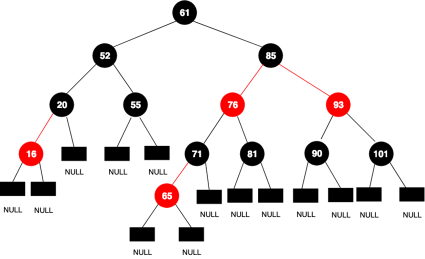

### Data Structure

#### Top-down(Top = Leader) vs Bottom-up (Backtrack from lowest people)
Top-down (Think from highest to lowest, and when reach the lowest we go back)
This is Bottom-UP (Recursively go to the leaf node and back track up to root)
eg 110 Balanced Binary Tree . For Top-down, we think of a height counter and track height starting from root as 0 and +1
going down to every level. For Bottom-Up, we going down and track the downest node and compare the smallest subset's tree height first
then according to the answer of the smallest subset left-right tree and return the answer, that for reference for larger subset left-right tree
Top-down -> from root node at the top to all the way down to the leaf node(s)
Bottom-up -> recursively go to the leaf node(s) and backtrack up to the root node one by one
Both can be recursive,

#### Prefix Sum
Solutions that require sequences of elements (A list of elements or objects that have been arranged in a sequential manner) 
to meet criteria often utilize prefix sums
Prefix Sum aka Cumulative sum 
eg \[1,2,3,4,5\] => prefixSum \[1,3,6,10,15\]  **PrefixSum doesn't always mean add them together, there could be logic
eg leet1248 (prefixSum or Sliding Window), the prefixSum depends on the occurence of odd number , if odd, cur+= 1 else 0 then => map.getOrDefault(cur,0) + 1 
we can calculate the sum of elements between two indices, 
subtracting the prefix sum corresponding to the two indices to obtain the sum directly instead of iterating over the subarray to find the sum.

eg leet1248(medium-hard) Key: exactly K sum = at most K sum - at most K-1 sum 
As for leet560, it contains negative in array so only prefixSum is allow, ** in Prefix we simply easy to get sum(i,j) = sum(0,j) - sum(0,i) , so that 
we can get the subset value easily
** Sliding Window only work in positive array

#### Sliding Window
The concept behind the sliding window pattern is to maintain a window that continuously expands from the right by adding elements 
until the conditions are not satisfied. 
Then, we adjust the window by shrinking it from the left until the condition is met again.
**Sliding Window technique not work when contains any negative number, extending more value could result in lower sum, 
complicating the process of determining the optimal subarray.
For this problem, we will simulate the process using a queue. 
A queue is suitable to simulate a sliding window because it efficiently adds and removes elements from both ends.

#### RED-BLACK TREE (TreeMap in java)

根部應該是黑色的。
樹的葉子應該是黑色的。
紅色節點必須有兩個黑色子節點。
黑色節點可以有任何子節點。
從節點到其葉子的路徑必須包含相同數量的黑色節點。 (52->20->null, 52->55->null all is 2 black node)
新增節點來代替葉子。

Initial Tree is: {4=15, Geeks=20, Welcomes=25, You=30}
The headmap is: {4=15, Geeks=20, Welcomes=25} // we get value before You
map_head = tree_map.headMap("You");  
For details : DataStructure\RedBlackTree.java
