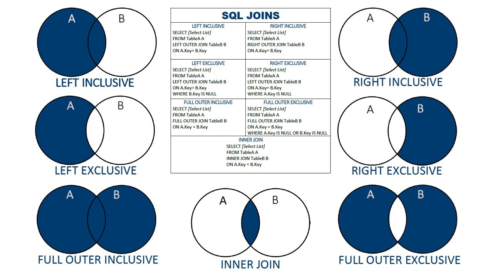
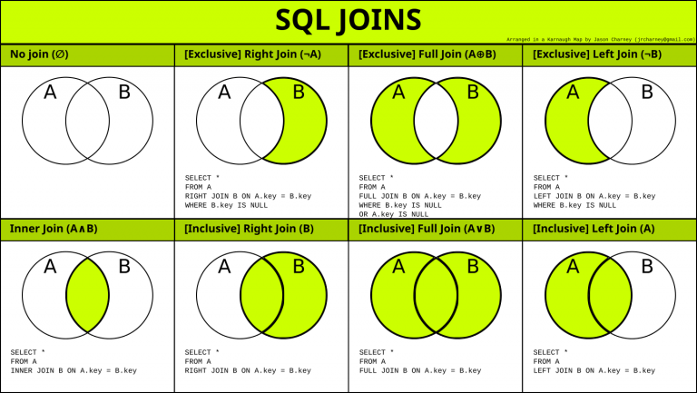

#### SQL Concept
### MYSQl Left Join (Origin from A + Intercept of A and B [Inclusive] OR exclude Intercept of A and B[Exclusive])
Left Join will put null value on not existing record, put everything in the left table
Table: A
id,name
Table: B
id, unique_id

if A.id is not find on B.id, it will create NULL on unique_id
```
select eu.unique_id, e.name from Employees e 
LEFT JOIN
EmployeeUNI eu on e.id = eu.id;
```
The LEFT JOIN keyword returns all records from the left table (table1), and the matching records from the right table (table2). 
The result is 0 records from the right side, if there is no match.

#### Inner Join (only display record when A match B, eg only A.id match B.id) , Inner Join =  JOIN (Natural Join)



the join will match every row from TableA with every row from TableB , if NO ON part
eg SELECT * FROM TableA  INNER JOIN TableB;

Else you specific it will have only matching result
SELECT * FROM TableA INNER JOIN TableB ON TableA.id = TableB.id;

#### 3-CTE(Common Table Expression)
Imagine you're cooking a meal. Before you start cooking, you gather all your ingredients and chop them up. 
That's what a CTE does in SQL. It's like preparing your ingredients separately before you start cooking.
```
WITH SaleDetails AS (
    SELECT 
        s.sale_id,
        p.product_name,
        s.year,
        s.price
    FROM 
        Sales s
    JOIN 
        Product p ON s.product_id = p.product_id
)
SELECT 
    product_name,
    year,
    price
FROM 
    SaleDetails;
```

#### SUBDATE() DATEDIFF()
Date -1 is not same as SUBDATE(Date, INTERVAL 1 DAY) why?
for example 1998-10-01 -1 should be 1998-9-31, HOWEVER the actual date should be 1998-9-30 , Therefore use SUBDATE or DATEDIFF 
follow with INTERVAL 1 DAY


#### function
any function must start with() without space eg SUM() // correct , SUM () // wrong

#### GROUP BY ( together with function eg AVG, SUM, COUNT)
SELECT COUNT(CustomerID), Country FROM Customers GROUP BY Country; // it mean we group same Country and COUNT how the row of Customer ID into number

If group by Student ID , so we will only combine when exactly match the Student ID and nothing else 
eg 
id = 1, subject = Math, 
id = 1, subject = English
It will merge together, and got unexpected result
RESULT: id = 1, subject = English OR id = 1, subject = Math

If group by student_id, subject_name 
the row of record will group follow (student_id + subject_name)
It will not merge together, unless both student_id and subject_name is same
id = 1, subject = Math, mark = 50
id = 1, subject = English, mark = 60
id = 1, subject = Math, mark = 79
id = 1, subject = English, mark = 120
id = 1, subject = PE, mark = 120
Similarly, if dont have aggregate +Function like Sum,Count, it will have unexpected result
eg we have SUM(mark) then we have reslt as
id = 1, subject = Math, mark = 129
id = 1, subject = English, mark = 180
id = 1, subject = PE, mark = 120

#### use > < operator on select column
Case 1 Select * from X where A > 3 (only A > 3 row allow)
Case 2 Select A > 3 from X (it will also have new column that A > 3 is 1 if true, 0 if else)
if rating < 3 returns either 1 and 0 for each group, why count(rating < 3) does not work?
SInce rating< 3 always return 1 or 0, count(rating <3) will stay the same and will be the number of all rows since it is always fed an non-null value.
Count only exclude null values for a given column
eg COUNT(0) is 6, COUNT(1) is 6 (as there is 6 row on the table), so COUNT accept any value except null COUNT(null)

#### Date (Java prefer DATE_FORMAT than EXTRACT)
%Y, %M ,%D => output: 2018, Decemeber , 18th
%y, %m ,%d => output: 18, 12 , 18
DATE_FORMAT(date, '%Y') // if date is 2018/06/04 => output: 2018 
YEAR(date) // get 2018
EXTRACT( YEAR_MONTH FROM `date` ) 

#### JOIN 
Case 1 JOIN Table ON X.id = X2.id
Case 2 JOIN (SELECT ....) AS X2  
SELECT t1.*
FROM employees t1
INNER JOIN (
SELECT id, min(salary) AS salary FROM employees GROUP BY id
) t2 ON t1.id = t2.id AND t1.salary = t2.salary;
You must SELECT id in the second query in order to compare it with ON

#### WHERE , IN  
WHERE + IN can use for filter match column
WHERE (order_date, customer_id) IN
(
SELECT customer_id, MIN(order_date) FROM Delivery group by customer_id
) // No output , order is matter (order_date,customer_id) != (customer_id, order_date)

#### No group By but agg function
SELECT customer_id, COUNT(*) FROM Delivery => output 1 row
eg {"headers": ["customer_id", "COUNT(*)"], "values": [[1, 7]]}
SELECT customer_id, COUNT(*) FROM Delivery GROUP BY customer_id => output many row accroding to number of customer_id
eg {"headers": ["customer_id", "COUNT(*)"], "values": [[1, 2], [2, 2], [3, 2], [4, 1]]}

#### Group By and Having
SELECT class FROM Courses GROUP BY class HAVING COUNT(student) >= 5 ;
// we only use Having with aggregate function after GROUP BY

#### Subquery
// We allow from a  table from subquery
eg 619
SELECT MAX(num) as num From
(
SELECT num from MyNumbers Group By num Having count(num) = 1
) AS unique_number;

SELECT MAX(num) AS num  FROM MyNumbers WHERE num IN (SELECT num FROM MyNumbers GROUP BY num HAVING COUNT(*) = 1);
https://leetcode.com/problems/biggest-single-number/discuss/3787911/5-7-Easy-different-solutions

#### LIMIT & OFFSET 
LIMIT is after Group By
The SQL query below says "return only 3 records, start on record 4 (OFFSET 3)":
SELECT * FROM Customers LIMIT 3 OFFSET 3;

#### Null on Aggregate function
MAX(null), SELECT(null) as num , all will return null as value
SELECT (SELECT num FROM MyNumbers GROUP BY num HAVING COUNT(num) = 1 ORDER BY num DESC LIMIT 1) AS num; 

#### Subquery allow change name of column
SELECT num.num2 from (SELECT num as num2 FROM MyNumbers GROUP BY num HAVING COUNT(num) = 1 ORDER BY num DESC LIMIT 1) as num; 

#### Order Sequence
FROM & JOINs determine & filter rows
WHERE more filters on the rows
GROUP BY combines those rows into groups
HAVING filters groups
ORDER BY arranges the remaining rows/groups
LIMIT filters on the remaining rows/groups

1. FROM
2. ON`
3. JOIN
4. WHERE
5. GROUP BY
6. WITH CUBE or WITH ROLLUP
7. HAVING
8. SELECT
9. DISTINCT
10. ORDER BY
11. TOP

#### 1731 (JOIN table allow outer access second table e2)
(JOIN subquery allow inner access outer table e1)
eg SELECT e.employee_id, e.name, (SELECT name from employees e1 where e.reports_to = e1.employee_id) AS name FROM employees e;
sub query can access e.xxx but e1 is not accessible to outer world

#### 1789 (UNION not allow share table column, must same column length)
~~~~sql 
SELECT employee_id, department_id FROM Employee Group By employee_id HAVING COUNT(*) = 1
UNION
SELECT employee_id, department_id FROM Employee Where primary_flag = 'Y'
~~~~

#### Partition
Mysql Partition 會將 table 依指定條件拆為多張隱藏 table
如此一來 APP 端不需另做修改可以直接用既有方式 query 查詢。
A PARTITION BY clause is used to partition rows of table into groups.
It is useful when we have to perform a calculation on individual rows of a group using other rows of that group.
It is always used inside OVER() clause.
The partition formed by partition clause are also known as Window.
This clause works on windows functions only. Like- RANK(), LEAD(), LAG() etc.
If this clause is omitted in OVER() clause, then whole table is considered as a single partition
The syntax for Partition clause is-

Window_function ( expression )
Over ( partition by expr [order_clause] [frame_clause] )
Here, order_clause and frame_clause are optional.
expr can be column names or built-in functions in MySQL.
But, standard SQL permits only column names in expr.

dense_rank() is built-in function to get rank (1,2,3 by order)
~~~~sql 
SELECT 
  *, 
  COUNT(employee_id) OVER(PARTITION BY employee_id) AS EmployeeCount 
FROM 
  Employee
  
select challenge_id, h_id, h_name, score, 
dense_rank() over ( partition by challenge_id order by score desc ) 
   as "rank", from hacker;
~~~~

#### SQL Join (Inclusive, Exclusive)
SQL JOIN and SQL OUTER JOIN is same, only not same when Inclusive or Exclusive(Where X.key IS NULL)
Generally JOIN is inclusive
FULL JOIN in MYSQL is not FULL OUTER JOIN, it simply combine all data together (eg 3 row on table A, 4 row on table B => 3*4 = 12)
in FULL OUTER JOIN, it should return no matching LEFT,RIGHT row, either matching LEFT row or matching RIGHT row (LEFT no Match + Right no Match + Match)
Basically LEFT JOIN(Exclusive) + RIGHT JOIN(Exclusive) + INNER JOIN  OR  LEFT JOIN result + RIGHT JOIN result
to achieve FULL OUTER JOIN (aka FULL JOIN)
SELECT * FROM TableA A
LEFT JOIN TableB B ON A.name = B.name
UNION
SELECT * FROM TableA A
RIGHT JOIN TableB B ON A.name = B.name

the UNION will remove duplicate rows, that's why it works


#### COUNT vs GROUP + COUNT
without GROUP, COUNT will basically consider 1 row as 1 count
with GROUP, COUNT will consider the GROUP By column, when same, as 1 count

#### Sequnce
SELECT => FROM => WHERE => GROUP BY => HAVING => ORDER BY

#### lead(column, index)  over()
lead will go to next row
over() will construct a window that contain the record
eg lead(id,1) over() nextRow
SUM(kilos_produced) OVER() total_produced
so that the along side will be the total_produced
~~~~sql
SELECT farmer_name,
       kilos_produced,
       SUM(kilos_produced) OVER() total_produced
 FROM  orange_production
WHERE  crop_year = 2017

#Leet 180
with cte as (
    select num,
    lead(num,1) over() num1,
    lead(num,2) over() num2
    from logs

)

select distinct num ConsecutiveNums from cte where (num=num1) and (num=num2)
~~~~

#### Think logic
Generally 1 aggreate function is find the maximum value 
SELECT MAX(num) FROM shop GROUP BY id; // find the maximum num of each id
Generally the specific column to get new column value, we use sub-query, eg Leet1164
we get product_id, new_price as price ... IN (Select product_id, MAX(change_date))
here we use change_date to get the price

#### Window function
In MySQL, they say the window function performs an aggregate-like operation on a set of query rows. Even though they work almost the same, 
the aggregate function returns a single row for each target field, but the window function produces a result for each row.

Aggregate function could be Window Function with OVER clause such as MAX, MIN, SUM. Without OVER, its aggregate function
As for Non-Aggregate function like LEAD, LAG,RANK, FIRST_VALUE, they need to use OVER clause
eg
~~~~sql
FIRST_VALUE(target field) 
        OVER(
    PARTITION BY target field // Target field to group
    ORDER BY target field // Target field to order
)
~~~~
The PARTITION BY works the same as GROUP BY. The only difference with GROUP BY is that it produces the result for each row.
You should be careful that we use the window function on the SELECT clause. Thus, it executes after the JOIN, WHERE, and GROUP BY clauses.
Leet1164 ( we select the first_value group by the product_id and order by the change date that <= 2019-08-16 DESC)
~~~~sql
SELECT DISTINCT
  product_id,
  FIRST_VALUE (new_price) OVER (
    PARTITION BY
      product_id
    ORDER BY
      change_date DESC
  ) AS price
FROM
  Products
      WHERE
  change_date <= '2019-08-16' 
~~~~

#### MySQL COALESCE()
Return the first non-null value in a list:
SELECT COALESCE(NULL, NULL, NULL, 'W3Schools.com', NULL, 'Example.com');
will return 'W3Schools.com'
