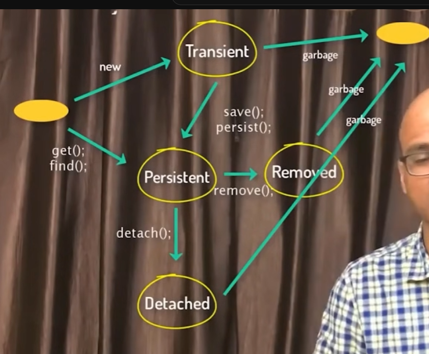

### Servlet + JSP + Hibernate
#### Client, Server, Servlet, Web Container
Java file which take the request from client and provide response as HTML page
Server go to Web Container (Tomcat, GlassFish, JBossWildfly) after receive client request
Special file inside Web Container(Deployment Descriptor web.xml) => upon different request call that which Servlet should be called
Client Request -> Server -> Web Container -> web container find mapping by web.xml(Deployment Descriptor) -> Servlet
Web.xml involve two step (servlet mention class name and servlet-mapping map between servlet class and html)
```
<!--web.xml--!>
<servlet>
<servlet-name>AddServlet</servlet-name>
<servlet-class>AddServlet</servlet-class>
</servlet>
<servlet-mapping>
    <servlet-name>AddServlet</servlet-name>
    <url-pattern>/abc.html</url-pattern>
</servlet-mapping>

```
Replacement of web.xml -> Annotation
@WebServlet("/abc.html")


#### Servlet Dispatcher vs SendRedirect
Request Dispatcher only work when two servlet is in same domain (peter.com)
if s1 domain != s2 domain (eg paypal)
SendRedirect (s1 send the response1 to client, and client send request2 to s2 and receive response2)
If s1 want to send variable to s2, it need SessionManagement

#### URL Rewriting(Parameter) vs req.getAttribute vs session.getAttribute vs Cookie
req.getAttribute use setAttribute -> RequestDispatcher -> forward
session.getAttribute use setAttribute -> sendRedirect
URL Rewriting use sendRedirect follow with the parameter 
cookie instance -> res.addCookie(cookie) -> sendRedirect -> req.getCookies() [array of cookie] -> loop cookie till getName

#### URL Rewriting
if Request Dispatcher is not work, we sendRedirect and add parameter , so the client will send new request to the redirect url
eg res.sendRedirect("sq?k=12")

#### Session 
usually for login, to verify whether the user is already login

#### ServletConfig(work 1 Servlet itself) VS ServletContext (share by all Servlet)
both defined in web.xml (for config: init-param in servlet) (for context : context-param )
Get config use ServletConfig cg = getServletConfig(); -> getInitParameter
Get context use ServletContext ctx = getServletContext(); -> getInitParameter
```
	
	<servlet>
		<servlet-name>MyServlet</servlet-name>
		<servlet-class>com.peter.MyServlet</servlet-class>
	    <!--ServletConfig-->	
		<init-param>
			<param-name>name</param-name>
			<param-value>MyServletPeter</param-value>
		</init-param>
	</servlet>
	<!--ServletContext-->
	<context-param>
		<param-name>Phone</param-name>
		<param-value>Samsung</param-value>
	</context-param>
```

#### Servlet Annotation
@WebServlet("add") exactly same as <servlet>...</servlet> and <servlet-mapping>

#### JSP (Java Server Pages) (new tool -> Thymeleaf)
Java code inside HTML, jsp converted to servlet then for web container to execute
Implicit Object : request, response in jsp
Scriptlet tag : <% %> (its a part of 'service()' method)
Declaration tag : <%! ... int abc = 3; %>(put outside 'service()' method)
Directive tag : <%@ page import="java.util.Scanner"%> (external tag for import)
Expression tag : <%= coef%> (fetch value from variable)

Directive tag 
@page (attribute can be lanuage/extends/import/session)
eg <%@ page language="java" contentType="text/html; charset=UTF-8" pageEncoding="UTF-8"%>
@include(include a jsp page) 
eg <%@ include file="abc.jsp %>
@taglib (external tag with own tag)
eg <@ taglib uri="uri" prefix="fx" %> (mention uri of the library) , so <fx:peter> it will know  

#### JSP error page
simply put errorPage="erorr.jsp" in Directive tag(%@)

#### MVC (Models Views Controllers : Client + Controller + View, (Service, DAO, Database is optional)) [Design Pattern] 
client send a request, will go to a controller
Controller job is to call the view(eg the layout page) and send the data to it
client send request -> controller recieve -> go and return data (POJO) to (view) -> view return to client
View == JSP, Controller == Servlet
** JSP should only for view, dont include busines logic
** Controller is only for accepting request and send response, eg (dont include JDBC)
** Methods should perform on another class call Service class, which contains JDBC code
** However complicated JDBC should encapsulated into DAO class, Service class contains method like addStudent, findStudent, etc
Therefore -> (Controller -> Service -> DAO) [**Very Important Concept]

#### Plain Old Java Object (POJO)
send a data in POJO format, eg all student information(id,name,class) into ONE object

#### JSTL (JSP Standard Tag Library)
<%@ taglib prefix="c" uri="http://java.sun.com/jsp/jstl/core" %> (prerequisite)
rather than <% %> , we can simply use <c:if> </c:if>
<c:out value="${label}" />
if call object.id, we must need setter and getter in jsp 
#### Expression Language 
${label} (directly fetch attribute from request)

#### Servlet Filter , Filter Chain (web.xml)
Filter can use for filter some common task , intercept the request , each filter dk others , just forward to next filter
eg (log , transaction, security, validation) , better to do it on filter than servlet (because its pluggable) 
web.xml define which filter to go for
javax.servlet.Filter Interface: (init, doFilter, destroy method)

#### Login with Servlet & JSP
HTTP is stateless, how to maintain the login status even in another page? (Session or Cookies)
Session store on server side, COokie store on client side (which cookie is non-integrity)
if(session.getAttribute("uname") == null) {
    response.sendRedirect("login.jsp");
}
session.removeAttribute("uname"); 
session.invalidate(); // we also need to remove cache page (prevent ppl click 'back')

response.setHeader("Cache-Control", "no-cache, no-store, must-revalidate"); // OR we not allow cache

#### Maven (project structure)
A built automation tool which help us create projects easily

#### Hibernate
Object Relational Mapping (ORM) tool for java
Fetch,Save,Modify Data , We need Connectors from Application and Database , we need queries
ORM (dont need SQL queries), define your table and data according to your classes 

#### JAVA Persistence API (JPA)
Persistence: data have to be persistent , eg database (MySQL, Oracle, SQL Server)
Java <-JDBC-> Persistence(Database) , with JPA we dont need SQL

#### Object Relational Mapping (ORM) [Concept] tool: hibernate, jpa, toplink
1 Class structure == 1 Table structure, 
1 Object = 1 Row
#### Hibernate
SessionFactory(Database configuration) to create Session s-> s.save(obj) -> stored in database  [Deprecated]
Configuration -> ServiceRegistry -> SessionFactory -> Session -> Transaction -> Transaction.commit()
```
Configuration con = new Configuration().configure().addAnnotatedClass(Alien.class);
ServiceRegistry reg = new StandardServiceRegistryBuilder().applySettings(con.getProperties()).build();

SessionFactory sf = con.buildSessionFactory(reg);
Session session = sf.openSession();

Transaction tx = session.beginTransaction();

session.save(peter);
// persist do not guarantee primary key exist
// save, update , merge, persist
tx.commit();
```


#### Hibernate Relations (1:1, 1:N, N:1, N:N)
@OneToOne
1 to 1 , 1 student 1 laptop : two table (student, laptop)
also extra column laptop_id inside student
@OneToMany in Student class, @ManyToOne in Laptop class
1 to N , 1 student List with N Laptop : three table(student, laptop, student_laptop) ,
laptop_id in "student" removed and new table created
"student_laptop" only store the student id and laptop id, so that 1 student id can have many laptop id
OR
2 table (student, laptop) , with extra column student_id in "laptop" contain student id


N to N
By default, it will create extra 2 table -> 4 table (student, laptop, student_laptop, laptop_student)
By mappedBy, we can use mappedBy on either student or laptop list class
'''
// inside Student.java , the "student" is inside Laptop.java
@ManyToMany(mappedBy="student")
private List<Laptop> laptops = new ArrayList<>();
'''
Therefore without mappedBy, the default behaviour will executed (eg 1:N create 1 extra table, N:N create 2 extra table)

#### Hibernate Relations fetching
Bad pratice
```// fetch the list of student
Laptop l = session.get(Laptop.class, 101);
System.out.println(l); // it iwll not print the student list wihout Collection OR Eager
// Use Collection instead
Collection<Student> studs = l.getStudent();
List<Student> studs2 = l.getStudent(); // because l.getStudent() is list = arraylist, so must list as parent
for(Student stud : studs) {
    System.out.println(stud);
}
session.getTransaction().commit();
```
Use fetch=FetchType.Eager instead (It will use left outer join and fetch is) (By default, its lazy and wont print the student)
Hibernate: select l1_0.id,l1_0.name,s1_0.laptops_id,s1_1.id,s1_1.marks,s1_1.name from Laptop l1_0 left join Laptop_Student s1_0 on l1_0.id=s1_0.laptops_id left join Student s1_1 on s1_1.id=s1_0.student_id where l1_0.id=?
null

#### Hibernate Cache
First Level Cache (Same session only) (if new session there will be new First Level Cache)
Second Level Cache (shared between other sessions, use external library) [eg ehcache, OS, Swam]
How to configure ? web.xml ->(ehcache, hibernate-chacche) cfg.xml -> configure (permission + provider)
change entity @Cachable (this entity is allow for caching) & @Cache (specify the strategies)

First Level Cache Example (Work in per session)
```
session.beginTransaction();
a = session.get(Alien.class, 101);
System.out.println(a);
a = session.get(Alien.class, 101);
System.out.println(a);
session.getTransaction().commit();
session.close();
```

#### ehcache (few update already) [core version must same as ehcache]  [However its not support jakarta, but javax]
```
<dependency>
    <groupId>org.hibernate</groupId>
    <artifactId>hibernate-ehcache</artifactId>
    <version>5.6.15.Final</version>
</dependency>
<!-- https://mvnrepository.com/artifact/org.hibernate/hibernate-core -->
<dependency>
    <groupId>org.hibernate</groupId>
    <artifactId>hibernate-core</artifactId>
    <version>5.6.15.Final</version>
</dependency>


@Cacheable
@Cache(usage=CacheConcurrencyStrategy.READ_ONLY)
on class
```

#### Hibernate Query Language (HQL) , SQL Similar as HQL  , Native Query == SQL
why need HQL when have save(), what if want multiple table and specific column
SQL: select rollno(column) from student(table)
HQL: select rollno(property) from Student(class name)
Simply just a class and select its variable == HQL
SQL: select * from student
HQL: from Student

SQL => ResultSet rs = st.executeQuery(sql) => while(rs.next()){}
HQL => List<Student> st = query.list() => easy to loop


#### Query , TypedQuery , MutationQuery
createQuery(query) is deprecated => createQuery(query, class)
HQL allow Concatenation & Prepared Statement
```
	    Query q = session.createQuery("from Student", Student.class);
	    List<Student> studs = q.getResultList();
	    // Type safety: The expression of type List needs unchecked conversion to conform to List<Student>
	    
	    Query q2 = session.createQuery("select id,name,marks from Student where id = 7", Object.class);
	    Object[] obj = (Object[]) q2.getSingleResult();
	    for(Object ob : obj) {
	    	System.out.println(ob);
	    }
	    // We must do Student s , to prevent conflicts with other marks variable in other class
	    Query q3 = session.createQuery("select id,name,marks from Student s where s.marks>60", Object.class); 
	    List<Object[]> obj2 = q3.getResultList();
	    
// Prepared Statement (?) , it support number(1) or string (b) with colon(:) and questionmark(?) :1 , :2, :3 or ?1 ?2 ?3
        Query q4 = session.createQuery("select sum(marks) from Student s where s.marks> ?1 and s.marks < :b", Object.class); 
        int a = 60, b = 90;
        q4.setParameter(1, a);
        q4.setParameter("b", b);
        Long obj3 = (Long) q4.getSingleResult();
        System.out.println(obj3);
```

SQL Query (Deprecated) =>  NativeQuery
query.setResultTransformer (Deprecated) => setResultListTransformer
~~SQLQuery query = session.createQuery("select * from student where marks > 60");~~
```
// Get whole student data
String sqlQuery = "SELECT * FROM student WHERE marks > 60";
NativeQuery query = session.createNativeQuery(sqlQuery, Student.class, sqlQuery); // tell what is it , its a Student class object
// query.addEntity(Student.class) // if above added ,no need
List<Student> studentObj = query.list();
for(Student s : studentObj) {
System.out.println(s);
}

// Get only name and marks **** cant make it 
```

#### Hibernate Object States / Persistence Life Cycle
1. Transient -> 2. Persistent -> (3. Detached OR 4. Remove Stage)

new => (transient state, Persistent state, Detached) => destroy states
1. create the object in hybernate => transient state => the moment close or destroy the application => its gone
2. Persistent state (save() persist())
   Value changed after saving, it will updated in the database (its still under persistent state)
3. Detached state (evict() , detach()) detach from the session, so it won't affect the database when updating the object
   Detached State similar as Transient (will disappear and wont affect database data)
4. Removed State (delete() , remove()) (object in java but not in database)

When fetch (get(), find()) => skipped Transient State and go to Persistent directly

```
// Transient State
Laptop l = new Laptop();
l.setId(51);
l.setName("Sony");

// Persistent State when save()
session.save(l);
l.setName("Pony");

// Remove State
session.remove(l);

session.getTransaction().commit();
// Detached State , commit after is default detach (wont affect db)
session.evict(l);
l.setName("Bony"); 
```

#### get vs load
session.get() vs session.load() // same output
Performance: get() hit database [Get an object], load() not use query [Give you a proxy object]
load() give you proxy object, it only used when some action eg System.out.println(laptop)
If not found, get() give null, load() give handleEntityNotFound exception


